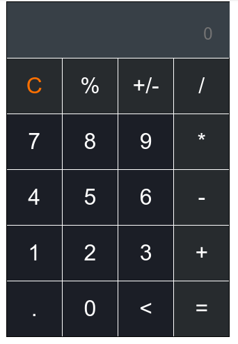
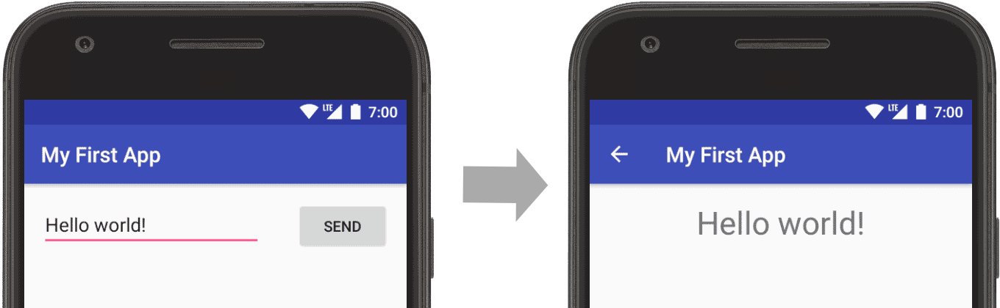

# Start-Kotlin

## LEVEL 1 -

   [Kotlin](https://kotlinlang.org/) is a simple programming language that can be easily read and understood. It automatically infers the type of variables. Kotlin was fun to learn so give it a try if you haven’t started.

### Let’s start learning it

1. **Printing Hello World ! -**

   We can use the print function for displaying the output on the screen. [Link for docs](https://kotlinlang.org/docs/basic-syntax.html#print-to-the-standard-output) 

2. **Introduction to Variables**
   
   Variables are used to hold values name, type value [Link](https://kotlinlang.org/docs/basic-types.html)

3. **Control the Flow**
   
   A control statement is a statement that determines whether other statements will be executed. An if statement decides whether to execute another statement, or decides which of two statements to execute. A loop decides how many times to execute another statement.Make sure to have a look on [if-else](https://kotlinlang.org/docs/basic-syntax.html#conditional-expressions), Loops ( [for](https://kotlinlang.org/docs/basic-syntax.html#for-loop) , [while](https://kotlinlang.org/docs/basic-syntax.html#while-loop) , [when](https://kotlinlang.org/docs/basic-syntax.html#when-expression) , [ranges](https://kotlinlang.org/docs/basic-syntax.html#ranges) )

4. **Fun with [Function](https://kotlinlang.org/docs/basic-syntax.html#functions)**

   A function is nothing but a collection of statements. A function needs to be called explicitly to execute that block of statements. To maintain readability and ease of understanding, we write n number of [functions](https://kotlinlang.org/docs/basic-syntax.html#functions) in our classes. Methods are used to perform certain actions.

5. **Classes and Objects**

   The class declaration consists of the class name, the class header (specifying its type parameters, the primary constructor, and some other things), and the class body surrounded by curly braces. Both the header and the body are optional; if the class has no body, the curly braces can be omitted.

      > Make sure to cover ([Classes](https://kotlinlang.org/docs/classes.html#top) , [Constructors](https://kotlinlang.org/docs/classes.html#constructors) , [Instances of classes](https://kotlinlang.org/docs/classes.html#creating-instances-of-classes) ,[Class members](https://kotlinlang.org/docs/classes.html#class-members), [Inheritance](https://kotlinlang.org/docs/classes.html#inheritance))

### **Task 1 -**

   Create a program that take input of user and greet the user

   Example -

   Input - “Samarth”

   Output - “Welcome Samarth ! ”

## Level 2 -

Well  congrats you have finished the  first level now in this we will try to create the UI using Jetpack Compose **Jetpack Compose -** Jetpack Compose is Android’s modern toolkit for building native UI. It simplifies and accelerates UI development on Android. Quickly bring your app to life with less code, powerful tools, and intuitive Kotlin APIs.

Learn about -

1. [Composable functions](https://developer.android.com/jetpack/compose/tutorial) -

   Jetpack Compose is built around composable functions. These functions let you define your app's UI programmatically by describing how it should look and providing data dependencies, rather than focusing on the process of the UI's construction (initializing an element, attaching it to a parent, etc.). To create a composable function, just add the [@Composable](https://developer.android.com/reference/kotlin/androidx/compose/runtime/Composable) annotation to the function name.

2. [Layouts](https://developer.android.com/guide/topics/ui/declaring-layout) -

   A layout defines the structure for a user interface in your app, such as in an [activity](https://developer.android.com/guide/components/activities). All elements in the layout are built using a hierarchy of [View](https://developer.android.com/reference/android/view/View) and [ViewGroup](https://developer.android.com/reference/android/view/ViewGroup) objects. A [View](https://developer.android.com/reference/android/view/View) usually draws something the user can see and interact with. Whereas a [ViewGroup](https://developer.android.com/reference/android/view/ViewGroup) is an invisible container that defines the layout structure for [View](https://developer.android.com/reference/android/view/View) and other [ViewGroup](https://developer.android.com/reference/android/view/ViewGroup) objects, Learn about [layout in compose](https://developer.android.com/jetpack/compose/tutorial)

3. [Material design](https://material.io/design) -

   Material is a design system created by Google to help teams build high-quality digital experiences for Android, iOS, Flutter, and the web. It is inspired by the physical world and its textures, including how they reflect light and cast shadows. Material surfaces reimagine the mediums of paper and ink.Learn about [Material in compose](https://developer.android.com/jetpack/compose/tutorial)

4. Lists and animations (Optional )

   Lists and animations are everywhere in apps. In this lesson, you will learn how Compose makes it easy to create lists and fun to add animations.Learn about [list and animation in Compose](https://developer.android.com/jetpack/compose/tutorial)

### **Task 2 -**

   Create UI for Calculator App

   **Example -**

## Level 3 -

In this level we will learn about the Intents and some android basics

1. [**Lifecycle -**](https://developer.android.com/guide/components/activities/activity-lifecycle)

   As a user navigates through, out of, and back to your app, the [Activity](https://developer.android.com/reference/android/app/Activity) instances in your app transition through different states in their lifecycle. The [Activity](https://developer.android.com/reference/android/app/Activity) class provides a number of callbacks that allow the activity to know that a state has changed: that the system is creating, stopping, or resuming an activity, or destroying the process in which the activity resides.

2.  [**Intents -**](https://developer.android.com/guide/components/intents-filters)

   An intent is an object representing some action to be performed. The most common, but certainly not only, use for an intent is to launch an activity. There are two types of intents—implicit and explicit. An explicit intent is highly specific, where you know the exact activity to be launched, often a screen in your own app.

3. [**APK -**](https://en.wikipedia.org/wiki/Android_application_package#:~:text=Android%20Package%20(APK)%20is%20the,in%20either%20Java%20or%20Kotlin.)

   Android Package (APK) is the Android application package file format used by the Android operating system, and a number of other Android-based operating systems for distribution and installation of mobile apps, mobile games and middleware. It can be written in either Java or Kotlin.

4. [**Gradle -**](https://developer.android.com/studio/build#:~:text=Android%20Studio%20uses%20Gradle%2C%20an,all%20versions%20of%20your%20app.) 

   Android Studio uses Gradle, an advanced build toolkit, to automate and manage the build process, while allowing you to define flexible custom build configurations. Each build configuration can define its own set of code and resources, while reusing the parts common to all versions of your app

### Task 3 -

Get Input on the first screen and display output on the second screen using Intents

**Example -**

> Tip  - Try to create better UI

## Level 4

1. **JSON -**

   JSON is an open standard file format and data interchange format that uses human-readable text to store and transmit data objects consisting of attribute–value pairs and arrays. [Wikipedia](https://en.wikipedia.org/wiki/JSON)

2. **API -**

   An application programming interface is a connection between computers or between computer programs. It is a type of software interface, offering a service to other pieces of software. A document or standard that describes how to build such a connection or interface is called an API specification. [Wikipedia](https://en.wikipedia.org/wiki/API)

3. **Volley -**

   Volley is an HTTP library that makes networking for Android apps easier and most importantly, faster. Volley is available on [GitHub](https://github.com/google/volley).It was developed by Google and introduced during Google I/O 2013. It was developed because there is an absence in Android SDK, of a networking class capable of working without interfering with the user experience. Although Volley is a part of the Android Open Source Project(AOSP), Google announced in January 2017 that Volley will move to a standalone library. It manages the processing and caching of network requests and it saves developers valuable time from writing the same network call/cache code again and again.

[Simple Api request using volley](https://developer.android.com/training/volley/simple)

### Task 4 -

  Create a Joke app which uses api for example ([https://sv443.net/jokeapi/v2/](https://sv443.net/jokeapi/v2/)) and show the joke on UI with loading screen
